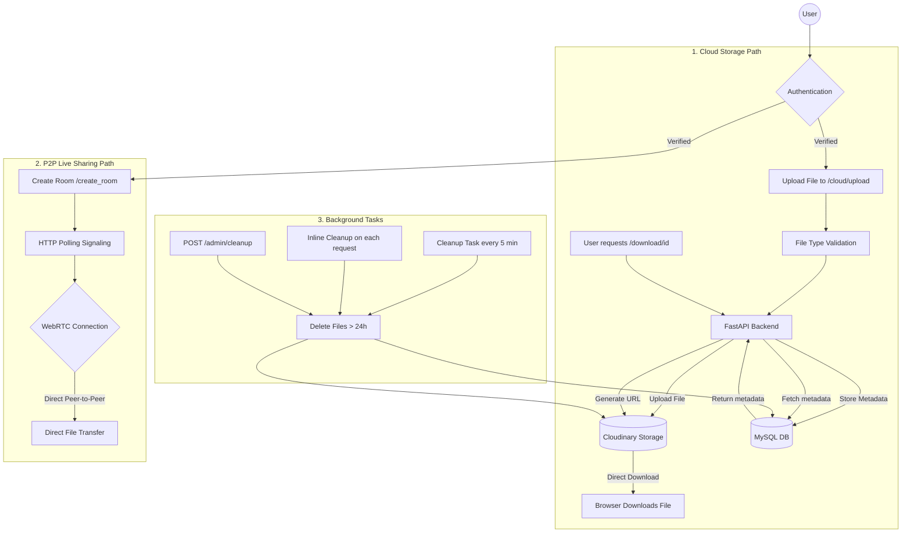

# EtherShare Application Workflow

This document describes the high-level architecture, workflows, and known design decisions / limitations of the EtherShare file-sharing system.

## System Overview

## Workflows

### 1. Cloud Storage (Shared via Cloud)
*   **Upload**: Files are received by the FastAPI backend, validated by MIME type, then streamed to **Cloudinary**.
*   **File Size**: Cloud mode is intended for small files (≤ 10–25 MB depending on Cloudinary limits). Large files should use P2P mode.
*   **Persistence**: File metadata (IDs, URLs, expiry) is stored in a **Railway MySQL** database.
*   **Sharing**: The backend retrieves file metadata from the database and generates a Cloudinary URL, which is used by the client to download the file directly from Cloudinary.
*   **Expiry**: All cloud files expire after 24 hours and are removed from Cloudinary and the database.

### 2. P2P Live Sharing (Browser-to-Browser)
*   **Signaling**: The server acts as a low-latency signaling relay using **HTTP polling** (300 ms interval) to exchange WebRTC offer/answer/ICE candidates.
*   **ICE / STUN**: Multiple public STUN servers are configured (Google, Cloudflare, stunprotocol.org, Ekiga) for NAT traversal. No TURN server is required for direct LAN or common NAT setups.
*   **Connection**: Once signaling is complete, a direct encrypted data channel is established between two browsers.
*   **Privacy**: Files never touch the server or cloud storage; they are transferred directly between peers.
*   **File Size**: P2P mode supports large files, limited by browser memory and device capability.

### 3. Automatic Cleanup (Three-layer)
*   **Background Task**: Runs every 5 minutes inside the FastAPI process. May pause during Render free-tier idle periods.
*   **Inline Cleanup**: Triggered on every `/cloud/upload` and `/cloud/download` request. Inline cleanup ensures expired files are removed even when background tasks are paused on free-tier hosting.
*   **Manual API**: `POST /admin/cleanup` — can be called by a cron job or manually to force a full cleanup sweep.

---

## Technical Notes & Limitations

### Authentication
*   Authentication is JWT-based (optional for demo purposes).

### WebRTC Reliability
*   STUN servers are configured for NAT traversal. Works well on standard home/office networks.
*   A TURN relay server is **not configured** (optional production improvement). P2P may fail on networks with symmetric NAT (very strict corporate firewalls or some mobile carriers).
*   *Production recommendation*: Add a Coturn TURN server and include credentials in `config/stun_servers.json`.

### HTTP Polling for Signaling
*   Polling is used (300 ms intervals) due to Render free-tier hosting constraints — WebSockets require a persistent process.
*   This introduces minor latency during the handshake phase (< 1 second in practice).
*   *Production recommendation*: Replace with WebSockets (`fastapi.WebSocket`) for real-time, zero-latency signaling.

### MySQL Database
*   A managed **Railway MySQL** instance is used for robust, scalable persistence.
*   It supports concurrent read/write workloads smoothly, unlike single-file databases.
*   *Production note*: Ensure connection pooling is configured efficiently for high loads.

### Cloudinary File Size Limitation
*   Free Cloudinary plan: 10 MB per file upload limit (API), 25 MB via direct upload.
*   Cloud mode is positioned for **small/medium files**. Large files should use P2P mode.
*   Frontend enforces a 500 MB soft limit; Cloudinary enforces its own hard limit.
*   *Production recommendation*: Upgrade Cloudinary plan or use multipart upload for larger files.

### File Type Validation (Security)
*   The `/cloud/upload` endpoint validates MIME type against an allowlist.
*   Executables (`.exe`, `.bat`, `.sh`, `.msi`, `.dll`, `.ps1`), and unknown types are blocked with HTTP 415.
*   P2P mode bypasses this restriction intentionally — all bytes are transferred directly between browsers and never stored server-side.

### Single-Server Architecture
*   Backend (FastAPI) and frontend (static HTML/JS) are served from the same Render service.
*   This is acceptable for a BCA/demo project and simplifies deployment.
*   *Production recommendation*: Separate into a dedicated CDN for static assets and a standalone API service (microservices pattern).

---
*Created by Antigravity AI — Last updated 2026-04-22*
